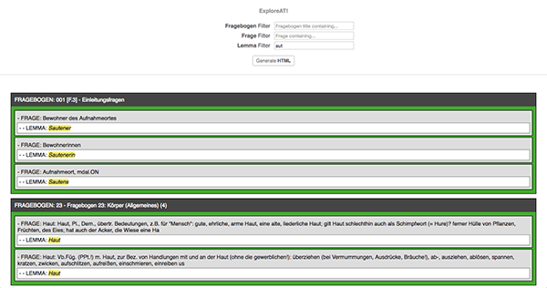

# Questionnaire Guide
_This project comes from the split of the original [exploreAT-collectionexplorer](https://github.com/acdh-oeaw/exploreAT-collectionexplorer) of [Alex Benito](https://github.com/ale0xb)_

This prototype provides an overview of questionnaires and related questions together with connected lemmas. Generate dynamic HTML based hierarchies with Questionnaires that hold Questions that reference Lemmas.



## Getting Started

These instructions will get you a copy of the project up and running on your local machine for development and testing purposes. See deployment for notes on how to deploy the project on a live system.

### Installing

Dependencies are been migrated from [API](https://github.com/acdh-oeaw/exploreAT-collectionexplorer-api). Therefore yarn or npm may be used for installing
the dependencies.

As indicated in **Bower** official site, it is recommended not to use it to manage the dependencies.

```
yarn
```
or
```
npm install
```

You can use any static server of your choice to serve the files for the webpage.
Additionally, [webpack](https://webpack.js.org/) may be used for compiling the source code
and package it into a few files (friendlier with download speed for the webpage).

**This prototype needs for an ElasticSearch database**

## Authors

* [Alex Benito](https://github.com/ale0xb) - *Implementation of the prototype* 
* [Alejandro Rodríguez](https://github.com/Janchorizo) - *Project split and migration to newer package managers* 

## License

This project is licensed under the MIT License - see the [LICENSE.md](LICENSE.md) file for details

